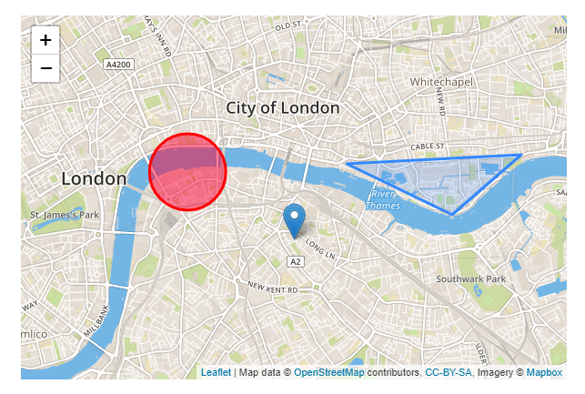
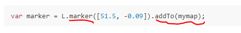

## [Leaflet Quick Start Guide](https://leafletjs.com/examples/quick-start/)
1. Preparing my page
   1. Include Leaflet CSS
   2. Include Laflet JavaScript **after** Leaflet's CSS
      1. 
      2. 
   3. Put a div element and make sure tha map container
      1. 
2. Setting up the map
   1. Create a map (set its view to our geographical coordinates and zoom level)
      1. 
   2. Add a tile layer to add to our map.(tile layer is usually created with [URL template](https://leafletjs.com/reference-1.4.0.html#tilelayer))
      1. 
3. Markers, circles and polygons
   1. 
   2. Add a marker
      1. 
   3. Add a circle
      1. 
   4. Add a polygon
      1. 
4. Working with popups(handle events)
   1. Leaflet has a very handy shortcut for using popups
      1. 
   2. Use popups as layers(like a standalone popup)
      1. 
5. Dealing with events
   1. you can react to user interaction
      1. 
   2. using a popup instead of an alert
      1. 
