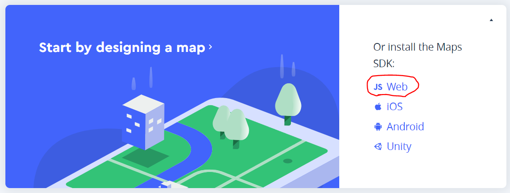
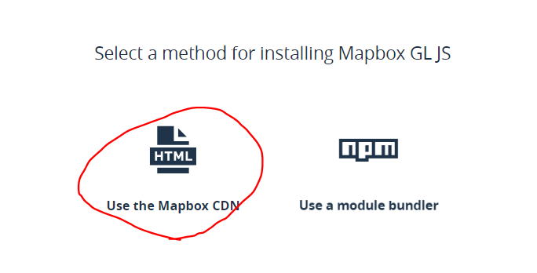
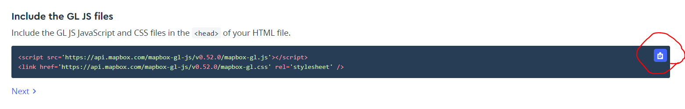
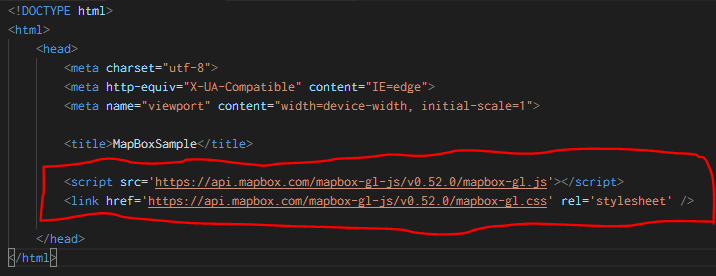
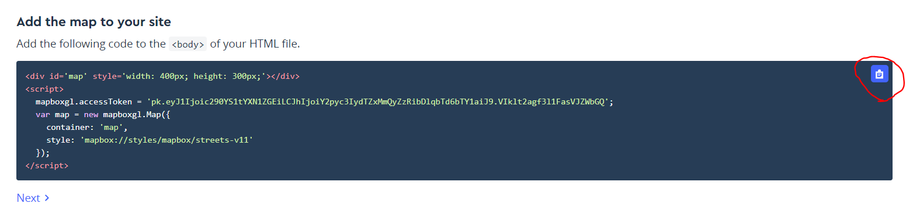
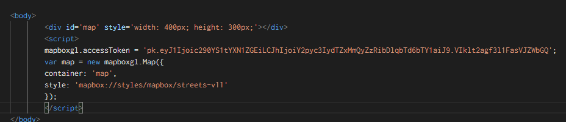

1. access mapbox account page
2. Start by designing a map >> JS Web
   1. 
3. Use the Mapbox CDN
   1. 
4. Copy html to header
   1. 
   2. 
5. Copy html to body
   1. 
   2. 
6. Congratulations!

