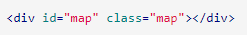

## [OpenLayers Quick Start](https://openlayers.org/en/latest/doc/quickstart.html)
1. Put a map on a page
   1. 
2. Understanding what is going on
   1. Include OpenLayers (CDN) but you can install with npm
      1. ``
   2. `
` container
      1. 
      2. 
   3. create a simple map in js
      1. 

