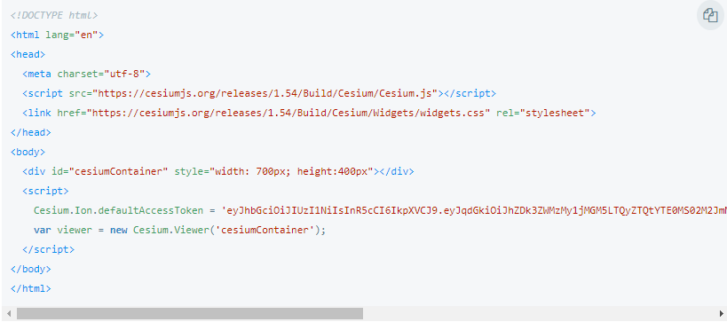
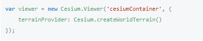
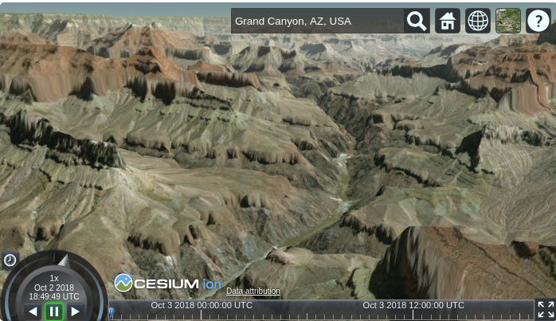
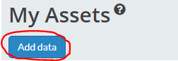
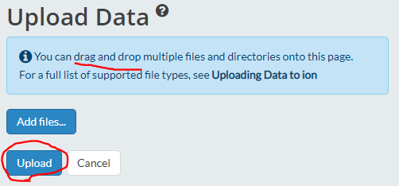
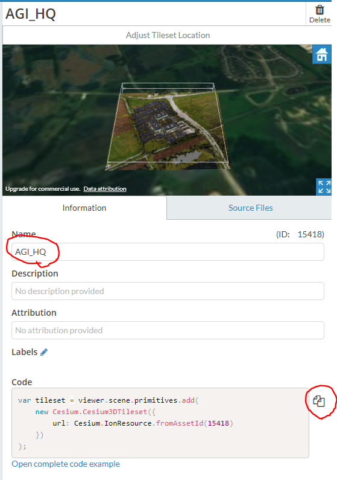

## [Cesium Tutorial Getting Started](https://cesium.com/docs/tutorials/getting-started/)

### in this case, use 3D content from Cesium ion

1. [Create a Cesium ion account](https://cesium.com/ion)
2. sample code
   1. copy code below and <strong>run on the server</strong>
   2. 
3. Adding Cesium World Terrain
   1. 
   2. 
4. Loading your own data
   1. upload your own data to [Cesium ion](https://cesium.com/ion)
      1. 
      2. 
   2. view data info at your assets page
      1. 
   3. add code to your script

