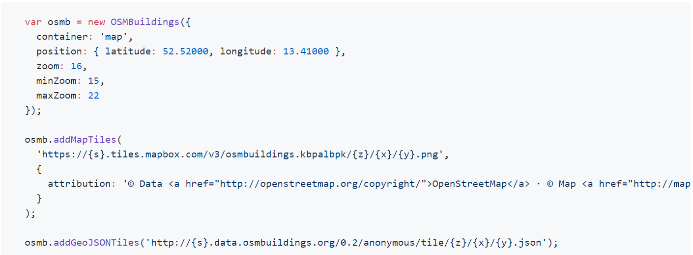

## [Quick Integration](https://github.com/OSMBuildings/OSMBuildings)

1. Link all required libraries in your HTML head section. Files are provided in folder `/dist`
   1. 
2. In a script section initialize OSM Buildings and add it to a DOM container.
   1. 
3. </strong>note >> Don't code `<!DOCTYPE html>`</strong> 
   1. You will get error : **Refused to apply style from ...**
